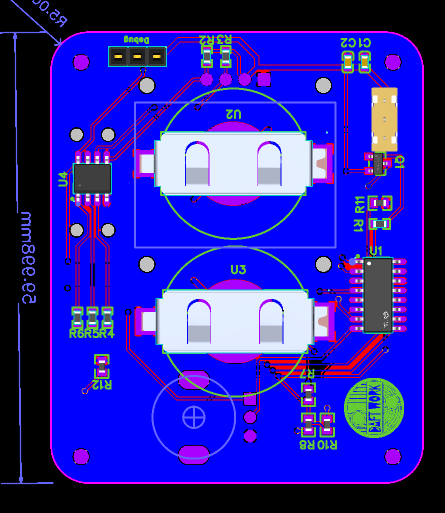

## cabnetBoy

Stefan Wagner CH32V003 콘솔을 기반으로한 변형. 

### 변경점
v1.1

일부 디자인 수정 

### 이전

2. 외부 메모리 채용

3. 더 많은 출력이 가능하게 하는 칩셋으로 교체

---

###

 
---

# 링크
Stefan Wagner 

https://github.com/wagiminator/CH32V003-GameConsole
